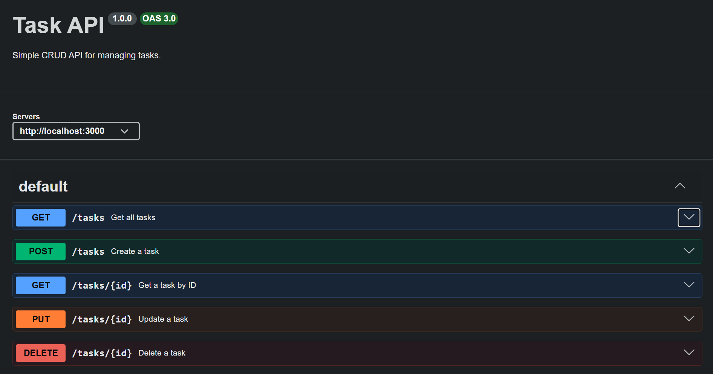

# Task API

A simple RESTful Task API built with Express.js as part of the FlyRank Backend AI Engineering Internship. It supports complete CRUD operations and includes interactive API documentation using Swagger UI.

---

## Features

- Get all tasks
- Get a task by ID
- Create a new task
- Update an existing task
- Delete a task
- Swagger UI documentation

---

## Installation & Run

## Installation & Run

### Clone the repository

```bash
git clone https://github.com/dev-hamza-ahmed/BackendAIEngineeringInternship.git
```

### Go to the assignment folder

```bash
cd BackendAIEngineeringInternship/Assignment_01
```

### Install dependencies

```bash
npm install
```

### Run the server

```bash
npm start
```

The server will start at:

```
http://localhost:3000
```

Swagger documentation:

```
http://localhost:3000/docs
```

---

## API Endpoints

| Method | Endpoint | Description |
|---------|----------|-------------|
| GET | `/` | API information |
| GET | `/health` | Health check |
| GET | `/tasks` | Get all tasks |
| GET | `/tasks/:id` | Get a task by ID |
| POST | `/tasks` | Create a new task |
| PUT | `/tasks/:id` | Update a task |
| DELETE | `/tasks/:id` | Delete a task |

---

## Example curl Output

### Create a Task

```powershell
curl.exe --% -i -X POST http://localhost:3000/tasks -H "Content-Type: application/json" -d "{\"title\":\"Buy milk\"}"
```

Output:

```http
HTTP/1.1 201 Created
X-Powered-By: Express
Content-Type: application/json; charset=utf-8

{
    "id": 4,
    "title": "Buy milk",
    "done": false
}
```

---

## Swagger UI



---

## Project Structure

```text
BackendAIEngineeringInternship/
│
└── Assignment_01/
    ├── images/
    │   └── swagger-ui.png
    ├── server.js
    ├── openapi.json
    ├── package.json
    ├── package-lock.json
    ├── .gitignore
    └── README.md
```

---

## Technologies Used

- Node.js
- Express.js
- Swagger UI Express
- OpenAPI 3.0

---

## Author

Hamza Ahmed

Backend AI Engineering Intern

FlyRank AI