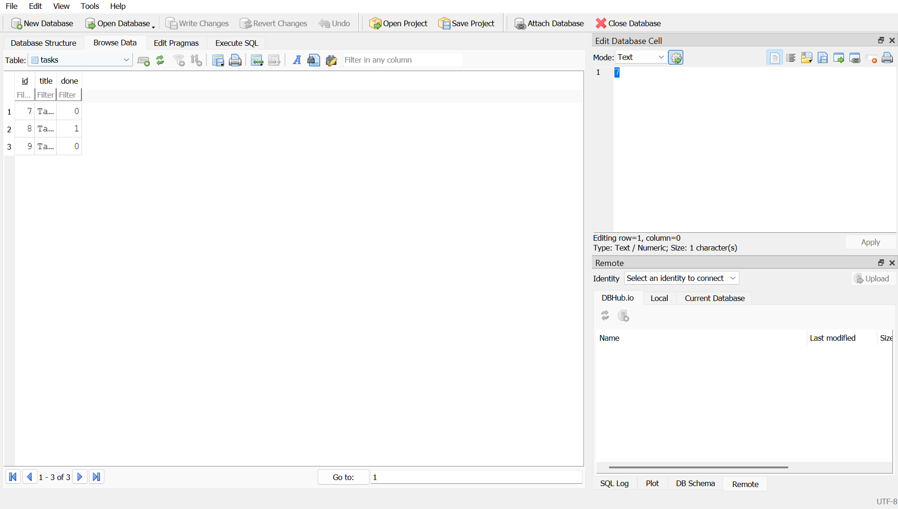

# Task API — SQLite Edition

A RESTful Task API built with Express.js, as part of the FlyRank Backend AI Engineering Internship (Week 3, Assignment A2). This is the direct sequel to Assignment 1: the same CRUD endpoints, but tasks are now stored in a real SQLite database instead of an in-memory list, so data survives a server restart.

---

## Features

- Get all tasks
- Get a task by ID
- Create a new task
- Update an existing task
- Delete a task
- Data persisted in SQLite (`tasks.db`) — survives restarts
- Layered architecture (routes → controllers → services → models)

---

## Why SQLite

SQLite was chosen because it needs no separate server or install — the entire database is a single file (`tasks.db`) that's created automatically the first time the app runs. For a small CRUD API like this one, that means zero setup for anyone who clones the repo, while still getting real persistence: tasks created today are still there tomorrow, even after the server restarts.

**Library note:** instead of `better-sqlite3`, this project uses Node's built-in `node:sqlite` module (`DatabaseSync`). It ships inside Node.js itself (stable from Node 22.13+ / 23.4+), so there's no native module to compile — which avoids the Python + Visual Studio Build Tools installation that `better-sqlite3` requires on Windows. The API is nearly identical (`db.prepare(sql).run()/.get()/.all()`), and the file it produces is a standard SQLite database, fully readable in DB Browser for SQLite.

---

## Where the database lives

`tasks.db` is created automatically in the project root the first time you run the app. It is git-ignored, so every fresh clone starts with a clean database that seeds itself with 3 example tasks on first run.

---

## Installation & Run

### Clone the repository

```bash
git clone https://github.com/dev-hamza-ahmed/BackendAIEngineeringInternship.git
```

### Go to the assignment folder

```bash
cd BackendAIEngineeringInternship/Assignment_02
```

### Install dependencies

```bash
npm install
```

### Run the server

```bash
npm start
```

The server will start at:

```
http://localhost:3000
```

`tasks.db` is created automatically on first run, with 3 seeded tasks.

---

## API Endpoints

| Method | Endpoint | Description |
|---------|----------|-------------|
| GET | `/` | API information |
| GET | `/health` | Health check |
| GET | `/tasks` | Get all tasks |
| GET | `/tasks/:id` | Get a task by ID |
| POST | `/tasks` | Create a new task |
| PUT | `/tasks/:id` | Update a task |
| DELETE | `/tasks/:id` | Delete a task |

---

## Example curl Output

### Create a Task

```powershell
curl.exe --% -i -X POST http://localhost:3000/tasks -H "Content-Type: application/json" -d "{\"title\":\"Buy milk\"}"
```

Output:

```http
HTTP/1.1 201 Created
X-Powered-By: Express
Content-Type: application/json; charset=utf-8

{
    "id": 4,
    "title": "Buy milk",
    "done": false
}
```

---

## Exploring the database by hand (Stage 4)

Opened `tasks.db` in [DB Browser for SQLite](https://sqlitebrowser.org/) and ran:

```sql
SELECT * FROM tasks WHERE done = 1;
```

**Result:** returned only the seeded task with `done = 1` ("Task 02"), confirming the `WHERE` clause filters rows directly in the database rather than in application code. Calling `GET /tasks` afterward from the running API reflected the exact same data with no restart needed — proof that the API and DB Browser read the same underlying file.



---

## Project Structure

```text
Assignment_02/
│
├── tasks.db                    (auto-created, git-ignored)
├── package.json
├── package-lock.json
├── .gitignore
├── images/
│   └── db-browser.png
├── README.md
└── src/
    ├── server.js                → entry point, app.listen()
    ├── app.js                   → Express app, middleware, routes
    ├── config/
    │   └── db.js                 → opens tasks.db, creates table, seeds
    ├── routes/
    │   └── task.routes.js        → HTTP verb + path → controller
    ├── controllers/
    │   └── task.controller.js    → req/res handling only
    ├── services/
    │   └── task.service.js       → validation + business rules
    └── models/
        └── task.model.js         → owns all SQL for the tasks table
```

---

## Technologies Used

- Node.js
- Express.js
- `node:sqlite` (built-in SQLite module)
- DB Browser for SQLite

---

## Author

Hamza Ahmed

Backend AI Engineering Intern

FlyRank AI